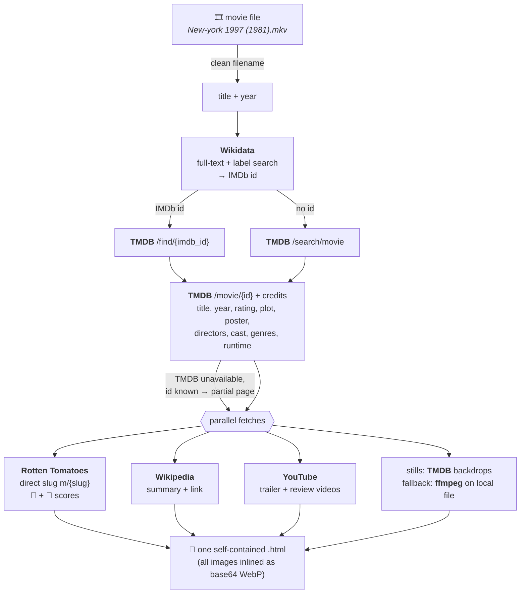
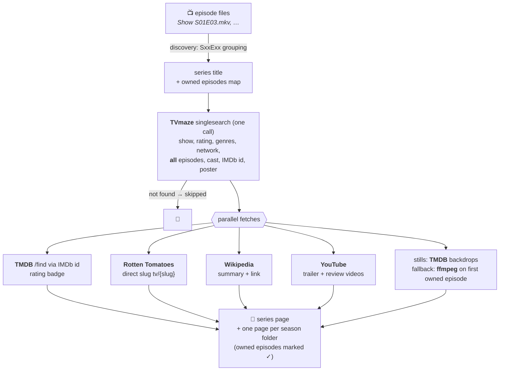
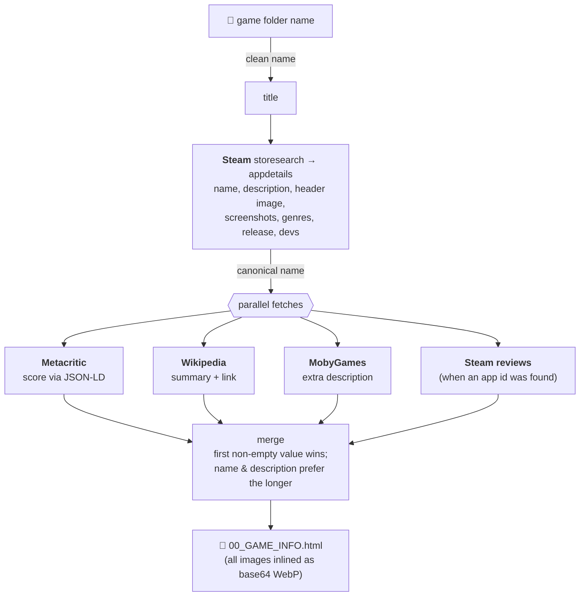

# x-info-generators

[](LICENSE)
[](pyproject.toml)
[](https://github.com/astral-sh/uv)

Turn your local **games**, **movies** and **TV series** into self-contained HTML info pages — then browse them all from one searchable catalog.

<p align="center">
  
</p>

<p align="center">
  <b>🌐 <a href="https://janroudaut.github.io/x-info-generators/">Live demo</a></b> — browse sample game &amp; video catalogs in your browser.
</p>

Every generated page is a **single portable `.html` file** — zero external dependencies, no CDN, no JS/CSS imports. Images are optimized (WebP via Pillow) and embedded as base64 data URIs. Fetched data is cached on disk, so re-runs are near-instant and can run fully **offline**.

## Install

```bash
uv tool install .
```

This installs two commands: [🎬 **`gen-video-info`**](#-gen-video-info) and [🎮 **`gen-game-info`**](#-gen-game-info).

---

## 🎬 gen-video-info

Handles **movies and TV series**, deciding what each video *is* from its **content**, never from the folder name (a directory is just an organizational placeholder — `old`, `films 2024`, a "collection"…).

> **Setup**: movie metadata comes from [TMDB](https://www.themoviedb.org/), which requires a **free API key**:
>
> 1. Create an account at <https://www.themoviedb.org/signup> and confirm the verification email.
> 2. Go to **Settings → API** (<https://www.themoviedb.org/settings/api>) and click **Create** under "Request an API Key", choosing the **Developer** type.
> 3. Accept the terms and fill in the short form (application type: *personal use*; a name, a short summary and any URL — your fork of this repo is fine).
> 4. The key is issued instantly on the same page. Export the **API Key** (v3) — or the longer **API Read Access Token** (v4), both work — as `TMDB_API_KEY`:
>
> ```bash
> export TMDB_API_KEY="your_key_here"   # e.g. in ~/.bashrc, or a sourced ~/.env
> ```
>
> or pass it per invocation with `--tmdb-api-key KEY` (overrides the environment variable).
> Without a key, series pages still work (TVmaze needs no key) but movie pages are reduced to filename + Rotten Tomatoes/Wikipedia/YouTube data.

- **Movies** → one `{filename}.html` next to the video.
- **File details** (via `ffprobe`, when the file is present): resolution and codec, plus the available **audio tracks and subtitles with language flags** — shown per episode on series/season pages (tracks belong to the episode, not the series), with a series-level union in the details table.
- **TV series** → episodes (`SxxExx`, in `Season N` subfolders or loose at the root) are grouped into **one series page**, plus **one page per season** that lives in its own folder. Owned episodes are marked (`✓`); the page lists the full season from the metadata source.
- **Collections** (a folder of several unrelated movies) → one page **per movie**; the folder name is ignored.
- Content not found on its metadata source (e.g. web-only clips) is **skipped** — no page is created.

```bash
gen-video-info /path/to/The.Matrix.1999.mkv           # single movie
gen-video-info -R /path/to/videos/                    # whole library (movies + series)
gen-video-info -R --force /path/to/videos/            # force regeneration
gen-video-info -R -C /path/to/videos/                 # remove generated HTML

# Skip directories (repeatable; glob, case-insensitive; wrap in /.../ for a regex)
gen-video-info -R --ignore '*Le dessous des images*' --ignore '/s\d+e\d+ sample/' /path/to/videos/
```

A movie page (poster, ratings, cast, plot, Wikipedia, screenshots, related videos) and a series page (ratings, network, cast, then every season with its episodes):

<p align="center">
  
  
</p>

<details>
<summary>Per-season page</summary>

Each season that lives in its own folder also gets a page listing every episode (owned ones marked `✓`) with summaries and ratings.

<p align="center">
  
</p>
</details>

### How screenshots are acquired

By default (`--screenshot-source auto`), stills are fetched **online** from
TMDB (`/movie|tv/{id}/images` — landscape *backdrops*, textless ones first), so a
page has real screenshots **even when generated from a name alone**, with no local
file and no FFmpeg. When a title has no online stills, it **falls back to FFmpeg**, which
extracts evenly-spaced frames from the local video (the first owned episode for a
series). Either way the results are cached, so re-runs do no extra work.

| `--screenshot-source` | Behaviour |
|-----------------------|-----------|
| `auto` *(default)* | Online stills, then FFmpeg fallback for titles that have none |
| `online` | Online stills only — no FFmpeg (titles without stills get none) |
| `ffmpeg` | Always extract frames from the local file (ignores online stills) |
| `off` | No screenshots at all |

`--max-screenshots N` caps how many are kept (default 8). FFmpeg is therefore
**only** needed for the fallback — see [Supported video formats](#supported-video-formats).

## 🎮 gen-game-info

Generates a `00_GAME_INFO.html` in each game directory, aggregating Steam, Metacritic, Wikipedia, MobyGames and Steam user reviews.

```bash
gen-game-info "/path/to/Hollow Knight"      # single game
gen-game-info -R /path/to/games/            # scan subdirectories as individual games
gen-game-info -R --force /path/to/games/    # force regeneration
gen-game-info -R -C /path/to/games/         # remove generated 00_GAME_INFO.html files
```

A full game page — description, details, Metacritic + Steam reviews, links and a screenshot gallery:

<p align="center">
  
</p>

## 🗂️ Catalog (`--index`)

`--index` builds a single, browsable **catalog** from the pages **already generated** on disk — no generation, no network. It scans the given paths for generated `.html`, reads each page (title, type, year, ratings, poster) and writes a self-contained catalog file (`00_INDEX.html` by default) with client-side **search, type & genre filters and sort**. The search box matches the **title and year** — and, for videos, also the **folder path** under the scanned root (type `007` to list a whole collection folder), the **cast** and the **directors**. A term is treated as a year when it starts with `19` or `20` and has at least 3 digits, and it matches by **prefix** — `197` lists the whole 1970s, while `007` only searches the text. Terms combine (AND): `keanu 1999` lists Keanu Reeves titles from 1999. Wrap a phrase in quotes for an exact match: `"daniel craig"` won't match a Daniel plus an unrelated Craig. The video catalog is the page at the top of this README; here's a games one:

<p align="center">
  
</p>

```bash
# a videos catalog (scan the dir, write ./00_INDEX.html)
gen-video-info --index /path/to/videos/

# a games catalog
gen-game-info --index /path/to/games/

# choose the output file
gen-video-info --index my-catalog.html /path/to/videos/
```

Video cards also show the available audio/subtitle languages as flags (🔊 🇫🇷 🇬🇧 💬 🇫🇷, subtitle flags collapse to a count beyond 3 languages) and a **"4K · 5.1" pill** on the poster (resolution + best above-stereo layout), all read from the pages' file details — and the toolbar gains an **audio-language filter** (ISO 639 variants like `fr`/`fra`/`fre` are merged).

A single-type catalog drops the type filter and names itself after that type (e.g. **Games**). The type is read from each page — so you *can* point one run at several roots for a combined catalog, but per-category is the usual case. Posters/headers are downscaled and inlined (one portable file); season pages are left out.

| Flag | Description |
|------|-------------|
| `--index [OUTPUT]` | Build the catalog under the given paths, then exit. An optional value is the output file; a directory there is treated as a path to scan (default output: `00_INDEX.html`) |
| `--title TEXT` | Catalog page title (default: derived — the single type if there's only one, else "Catalog") |
| `--max-depth N` | Max directory depth scanned by `--index` (default: 5) |
| `--wsl` | Emit Windows `file://` links (e.g. `D:/…`) for `/mnt/<drive>/` paths, so a catalog built under WSL opens correctly in a Windows browser |

> **Tip:** run any command with `-h` / `--help` for the full, authoritative option list — it's always in sync with the installed version.

---

## Caching

Successful fetches (metadata **and** optimized images) are cached under `~/.cache/x-info-generators/`
(respects `XDG_CACHE_HOME`), one JSON file per entry. Failures are never cached, so missing sources
are retried on the next run. The cache **never expires on its own** — cleanup is explicit.

| Flag | Description |
|------|-------------|
| `--no-cache` | Disable the cache (always hit the network, store nothing) |
| `--update-cache` | Re-fetch everything and overwrite cached entries (refresh stale data) |
| `--offline`, `--cache-only` | Use only cached data; make **no** network requests (and no FFmpeg). Pair with `--force` to re-render the whole library from cache after a template change |
| `--purge-cache` | Delete cache entries older than `--cache-ttl` days, then exit (no path needed) |
| `--cache-ttl N` | Age in days used by `--purge-cache`; `0` purges everything (default: 30) |

```bash
gen-video-info -R --offline --force /path/to/videos/   # re-render from cache, no network
gen-video-info --purge-cache --cache-ttl 0             # wipe the cache
```

## Common options

| Flag | Description |
|------|-------------|
| `-R, --recursive` | Scan subdirectories |
| `--force` | Regenerate even if `.html` already exists |
| `-C, --cleanup` | Remove generated `.html` files (incl. series + season pages) |
| `--no-color` | Disable emoji and color output |
| `--debug` | Print aggregated data for debugging |
| `--max-screenshots N` | Limit number of screenshots (default: 8) |
| `--screenshot-source MODE` | Where stills come from: `auto` (online, FFmpeg fallback — default), `online`, `ffmpeg`, `off` |
| `-V, --version` | Show version |
| `-h, --help` | Full, authoritative CLI reference |

`--ignore` and `--screenshot-source` are specific to `gen-video-info`.

## Supported video formats

Common ones: `.mp4`, `.mkv`, `.avi`, `.mov`, `.webm`, `.ts`, `.mpg`, `.m4v`, `.wmv`, `.flv` — plus a broad set of other containers (`.m2ts`, `.mpeg`, `.vob`, `.3gp`, `.divx`, `.rmvb`, `.mxf`, …). In practice anything **FFmpeg** can read is fine.

[FFmpeg](https://ffmpeg.org/) is **optional** — stills come from TMDB by
default, and FFmpeg is only the local fallback (see
[How screenshots are acquired](#how-screenshots-are-acquired)). Without it in
`PATH`, titles lacking online stills simply get no screenshots; everything else
is still fetched.

## Data sources

<details>
<summary>🎮 Games</summary>

| Source | Data |
|--------|------|
| Steam API | Title, description (`about_the_game`), header image, screenshots, genres, release date, developers, publishers |
| Steam Reviews | User reviews with recommendation badge |
| Metacritic | Score (via JSON-LD) |
| Wikipedia | Summary, page link |
| MobyGames | Additional description, page link |
</details>

<details>
<summary>🎬 Movies &amp; 📺 TV series</summary>

**Movies**

| Source | Data |
|--------|------|
| [Wikidata](https://www.wikidata.org/) | Resolves the IMDb id robustly (full-text + label search), avoiding IMDb's flaky search endpoint |
| [TMDB](https://www.themoviedb.org/) `/movie/{id}` (+credits, via `/find/{imdb_id}`) | Title, year, runtime, TMDB rating, plot, poster, directors, cast (with characters & photos), genres — requires `TMDB_API_KEY` |
| TMDB `/movie/{id}/images` | Online backdrops (the default screenshot source) |
| Rotten Tomatoes | Tomatometer + Audience scores (clickable rating badges) |
| Wikipedia | Summary, page link |
| YouTube | Official trailer, review/trivia videos with thumbnails |
| FFmpeg | Screenshots extracted from the local video (fallback when no online stills); `ffprobe` reads resolution + audio/subtitle tracks |

**TV series**

| Source | Data |
|--------|------|
| [TVmaze](https://www.tvmaze.com/api) | Series + all episodes + cast in one call: rating, genres, network, episode runtime, IMDb id, poster, per-season episode list (names, summaries, ratings) |
| TMDB | Rating badge + online backdrops (via the TVmaze-provided IMDb id) |
| Rotten Tomatoes (`/tv/`) | Tomatometer + Audience scores |
| Wikipedia, YouTube, FFmpeg | As for movies (FFmpeg fallback takes frames from the first owned episode) |

This product uses the TMDB API but is not endorsed or certified by [TMDB](https://www.themoviedb.org/).
</details>

### Acquisition flow

Every fetch below goes through the [on-disk cache](#caching) first — a re-run only hits the network for missing entries.

<details>
<summary>🎬 Movies</summary>


</details>

<details>
<summary>📺 TV series</summary>


</details>

<details>
<summary>🎮 Games</summary>


</details>

## Development

```bash
uv run gen-video-info /path/to/movie.mkv     # dev run (resolves deps into .venv automatically)
uv run gen-game-info /path/to/game

uv tool install --force --reinstall .        # reinstall the global commands after changes
```

> Run `uv run` **from the project directory** — otherwise uv falls back to the globally installed (possibly stale) tool.

<details>
<summary>Project structure</summary>

```
src/x_info_generators/
├── __init__.py          # __version__
├── display.py           # DisplayMode (emoji/color management)
├── utils.py             # format_bytes, base64 encoding, run_in_executor, path_matches_ignore
├── images.py            # Pillow image optimization (→ WebP), cached_image_data_uri, downscale_data_uri
├── http.py              # aiohttp session, download with progress bar
├── cache.py             # FetchCache (on-disk cache), purge_cache
├── processing.py        # ItemStats, RunStats, print_run_summary, cleanup_html_files
├── cli.py               # Common CLI arguments
├── index.py             # --index catalog: scan generated pages → 00_INDEX.html
├── templates.py         # Jinja2 rendering, score_color_class & linebreaks filters
├── templates/
│   ├── base.html.j2     # Common dark theme CSS, HTML structure
│   ├── game_info.html.j2
│   ├── movie_info.html.j2
│   ├── series_info.html.j2
│   ├── season_info.html.j2
│   ├── index.html.j2    # catalog page
│   └── _series_macros.html.j2   # shared ratings_block, cast_list, episode_list macros
├── game/
│   ├── cli.py           # gen-game-info entry point
│   ├── fetchers.py      # Steam, Metacritic, Wikipedia, MobyGames
│   └── processing.py    # clean_game_title, merge_data, process_game_directory
└── video/
    ├── cli.py           # gen-video-info entry point
    ├── discovery.py     # content-based classification (movies vs series, collections)
    ├── fetchers.py      # Wikidata, TMDB, TVmaze, Rotten Tomatoes, Wikipedia, YouTube, FFmpeg
    └── processing.py    # process_movie_file, process_series
```
</details>

## License

[WTFPL](LICENSE) — Do What The Fuck You Want To Public License.
